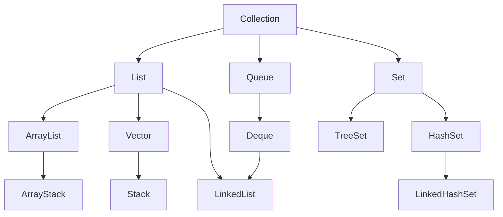
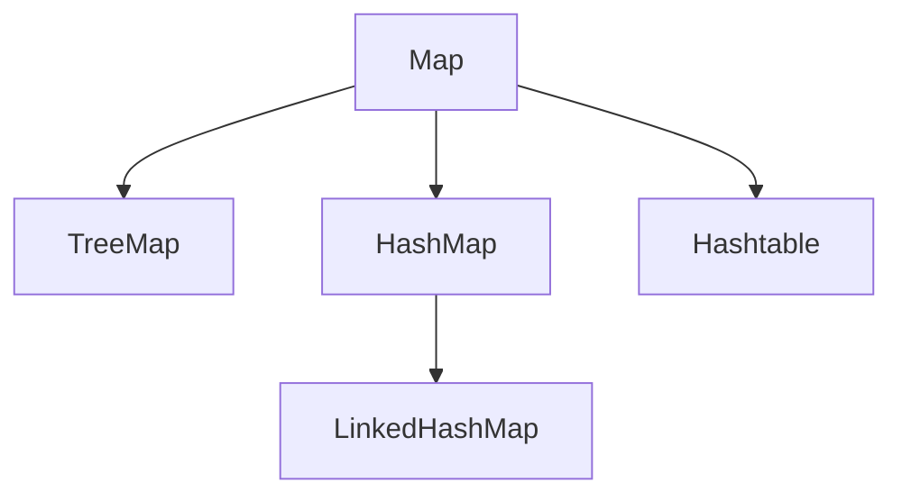

# 集合概述

集合分Collection集合和Map集合，

### Collection

collection是单列集合根接口，其常用子接口/子类如下图

* List作为有序集合根接口，其实现类都是有序集合，允许有数据重复【有序无序指的是插入顺序而不是排序】
  * ArrayList：底层是数组的有序集合，线程不安全，增删慢，查找块
  * LinkedList：底层是链表的有序集合，线程不安全，增删快，查找慢
  * Vector：底层是数组的有序集合，线程安全，增删慢，查找块
    * Srack：实现了一个标准的后进先出的栈

* Set作为无序集合根接口，其实现类都是无序集合，不允许有数据重复
  * TreeSet：底层是树的无序集合
  * HashSet：底层是哈希表的无序集合
    * LinkedHashSet：**有序**集合，由链表保证有序，由哈希表保证元素唯一
* Queue作为队列根接口，定义了队列头的移除和队列尾的添加操作
  * Deque作为双端队列接口，可以操作头部和尾部的添加移除，因此也可以作为堆栈

### Map

Map是键值对集合根接口，其常用子类/子接口如下图

* HashMap：没有同步， 线程不安全，可存入空key和空value
  * LinkedHashMap：双向链表和哈希表实现
* Hashtable：同步， 线程安全
* TreeMap：红黑树对所有的key进行排序

