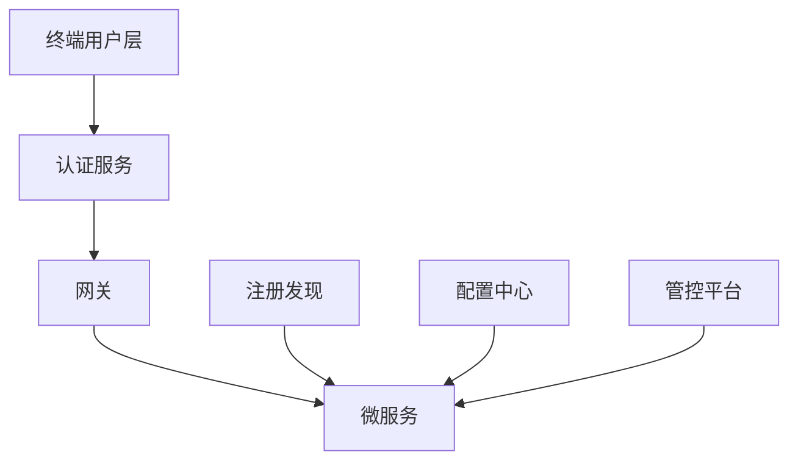

# 分布式架构选型

### 一、常见微服务架构

### 二、微服务框架

|        框架        |                | 服务调用方式 |
| :----------------: | :------------: | ------------ |
| Apache SpringCloud | 微服务生态完整 | RESTful风格  |
|   蚂蚁 SOFAStack   |                | RESTful/RPC  |
|  华为ServiceComb   |                |              |
|     阿里Dubbo      |                | RPC          |

### 三、框架内结构选型

##### 1. 注册中心

* Eureka

##### 2. 网关

* SpringCloud Zuul

##### 3. 认证服务

* Spring OAUTH2

##### 4. 配置中心

* Apollo

##### 5. 管控平台

 * 监控预警
   	* 基于ELK进行分布式日志收集分析
 * 监控数据收集
   	* MetricBeat和FileBeat
 * 监控数据展示
   	* ES
 * 链路追踪
   	* Zipkin
 * API统计
   	* Elastic的APMServer实现服务的应用性能管理

##### 6. 服务间调用

* Hystrix断路器--服务间调用依赖的容错组件，实现自动化的限制、熔断、隔离和降级功能
* Fegin服务间通信--开箱即用

##### 7. API测试

* Swagger

##### 8. 持续集成发布CI/CD

* Jenkins

